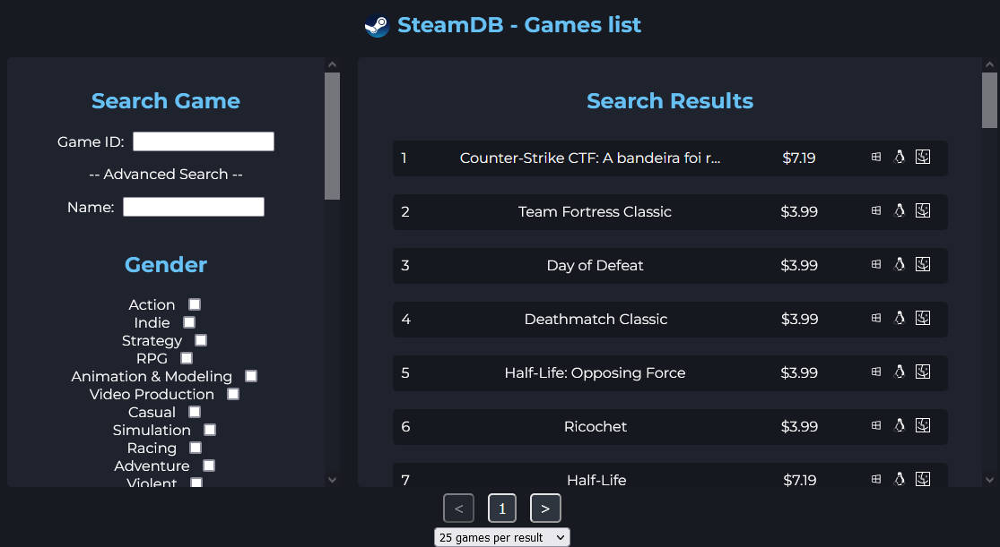

#Trabalho Banco de dados M3

Projeto final da matéria de banco de dados, utilizar os dados de um banco de dados e integrar a uma aplicação, neste caso, foi criado uma página de jogos usando o Express framework.

*Observação: Este projeto não possui associação com SteamDB ou Steam, utilizando apenas dados públicos e sem retorno financeiro*